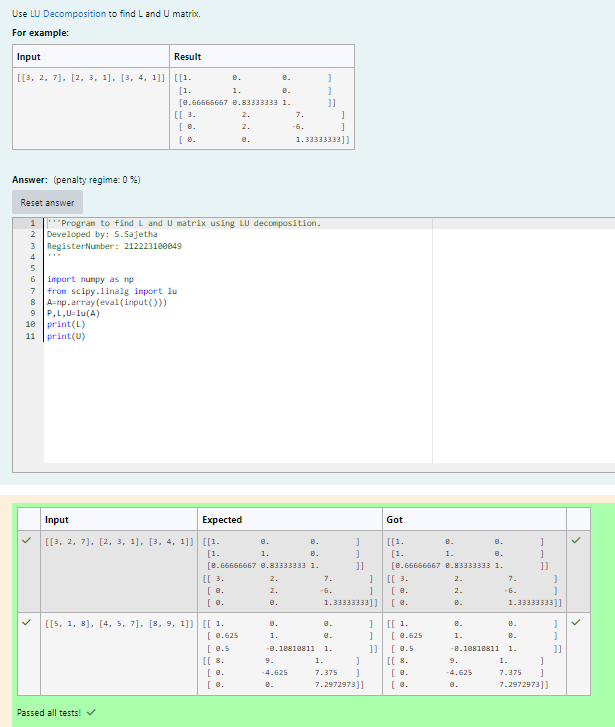
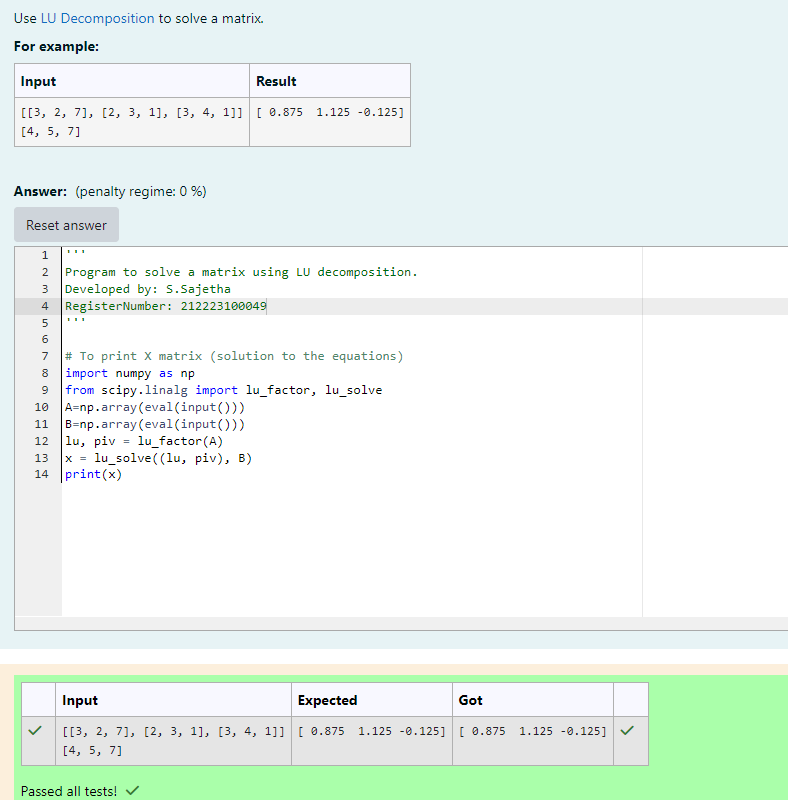

# LU Decomposition 

## AIM:
To write a program to find the LU Decomposition of a matrix.

## Equipments Required:
1. Hardware – PCs
2. Anaconda – Python 3.7 Installation / Moodle-Code Runner

## Algorithm
### Step 1:
For finding the L and U matrix:
Define the package as scipy.linalg import lu 
### Step 2:
Get input from the user and print L and u matrix by 'print' 
### Step 3:
For finding the LU decomposition of a matrix:
Degine a package as "from scipy.linalg import lu_factor, lu_solve" and create the variable 'x' include the package in that variable
### Step 4:
print the variable 'x'

## Program:
(i) To find the L and U matrix
```
Program to find the L and U matrix.
Developed by: S.Sajetha
RegisterNumber: 212223100049

import numpy as np
from scipy.linalg import lu
A=np.array(eval(input()))
P,L,U=lu(A)
print(L)
print(U)
```
(ii) To find the LU Decomposition of a matrix
```
Program to solve a matrix using LU decomposition.
Developed by: S.Sajetha
RegisterNumber: 212223100049

# To print X matrix (solution to the equations)
import numpy as np
from scipy.linalg import lu_factor, lu_solve
A=np.array(eval(input()))
B=np.array(eval(input()))
lu, piv = lu_factor(A)
x = lu_solve((lu, piv), B)
print(x)
```
## Output:
()


## Result:
Thus the program to find the LU Decomposition of a matrix is written and verified using python programming.

